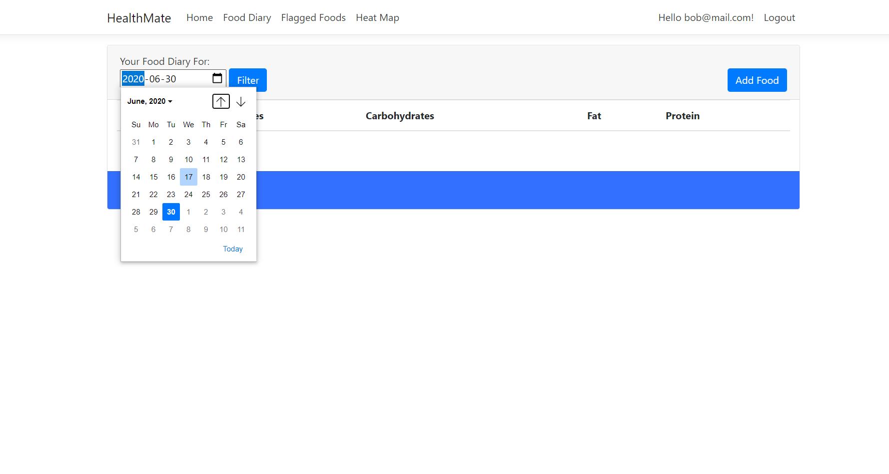
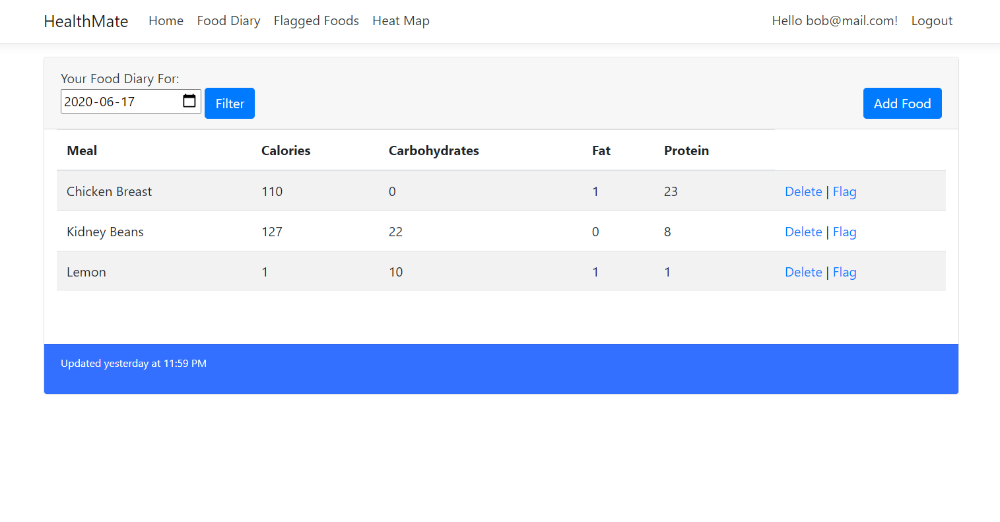
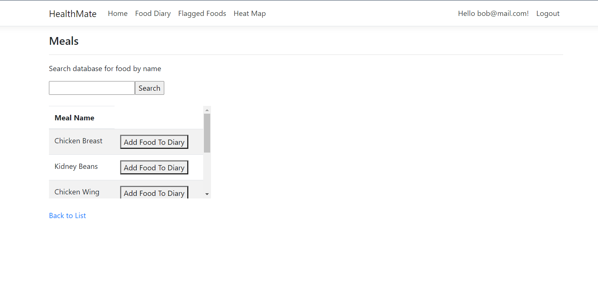
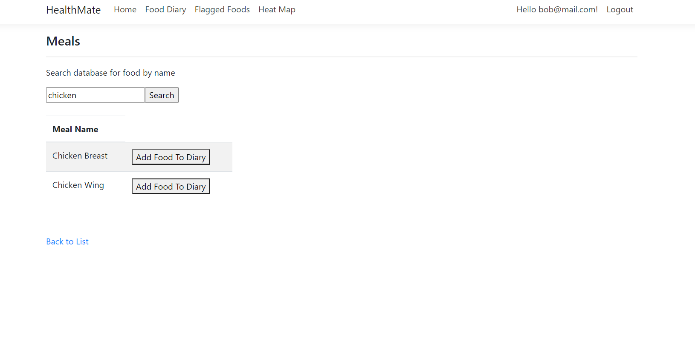
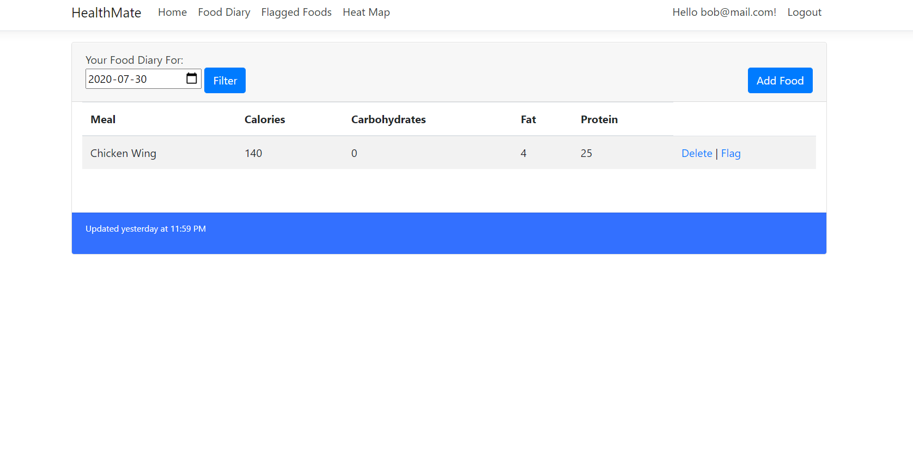
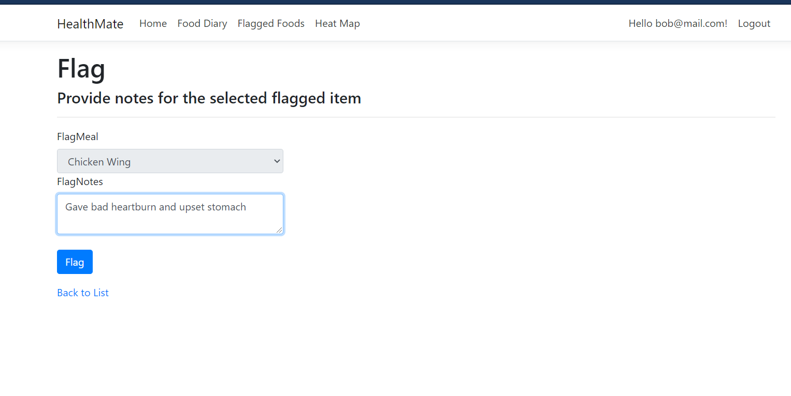
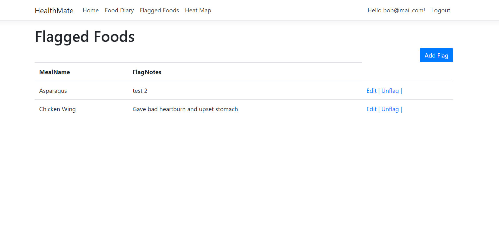
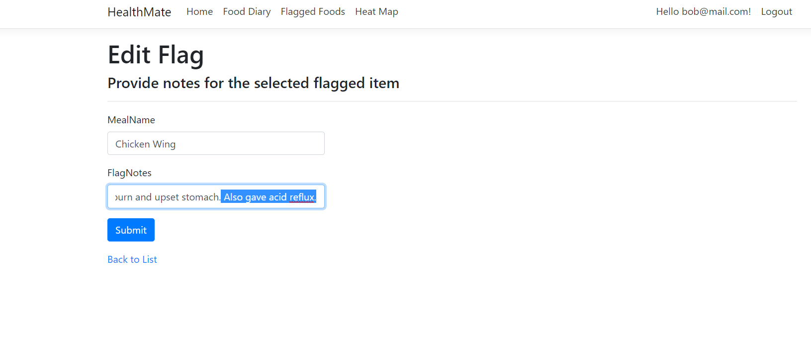
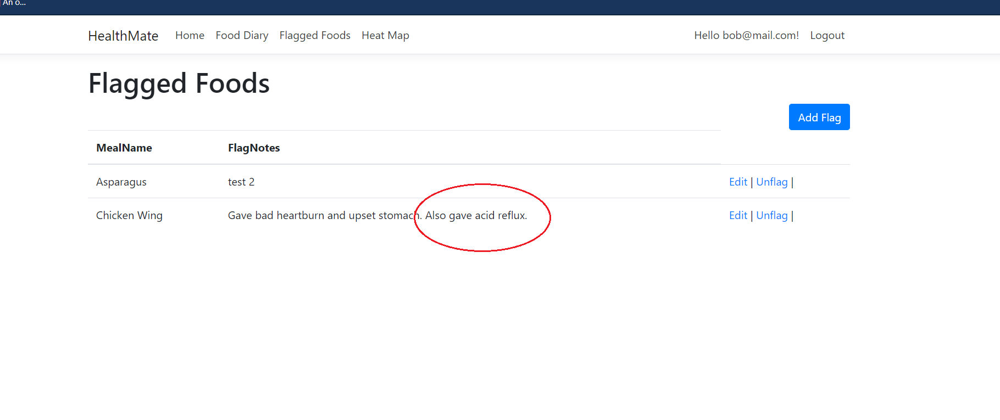

# Health-Mate
Health-Mate Web Application.
 
Tracker for food elimination diets, helps detect and keep track of adverse food reactions

In the process of updating to V2 where it will be hosted online with additional features.

Quick overview:

Choose a date           |  filter by date
:-------------------------:|:-------------------------:
 |  

Add food to diary             |  Filter foods from SQL database
:-------------------------:|:-------------------------:
 |  

Food saves to diary           |  Flag Food (causes reaction)
:-------------------------:|:-------------------------:
 |  

Food is flagged           |  Edit flags
:-------------------------:|:-------------------------:
 |  

edit success           |  Also included
:-------------------------:|:-------------------------:
 |  User logins, user specific data, & More.
